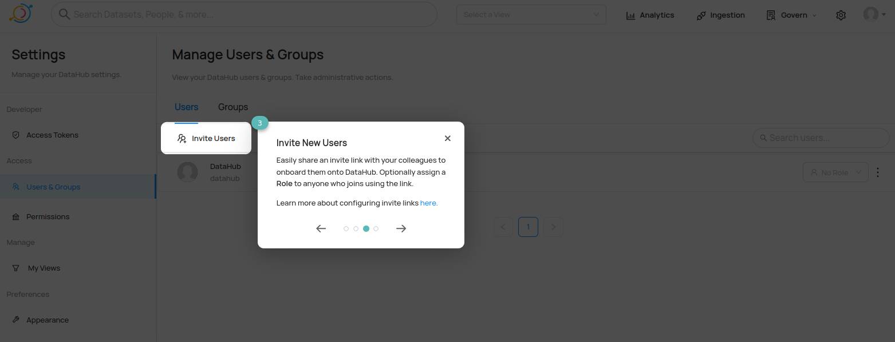

# Datahub Test Run

It was a bit harder to figure out [which components](https://datahubproject.io/docs/architecture/architecture) were necessary to make this system run. [datahub-project/datahub](https://github.com/datahub-project/datahub/tree/master/docker) and [acryldata/datahub](https://github.com/acryldata/datahub/tree/master/docker) (the PAAS version of datahub) have numerous `docker-compose...yml` options.

I switched 1 port number from its default.

Start the system up via

```bash
docker compose up
```

no `--build`ing here (I didn't want to have to hunt down all of the Dockerfiles, so I accepted the default images).

Access the web UI at [http://localhost:9012](http://localhost:9012) and log in using:

* **username:** datahub
* **password:** datahub

## User Interface





* [Roles link](https://datahubproject.io/docs/authorization/roles)


## Ingestion


I tried setting up an ingestion but it kept failing. I'm pretty sure I just wasn't using the right host or something. I tried following this [possibly relevant SO post](https://stackoverflow.com/questions/74677369/docker-network-connect-to-postgres-db-from-datahub-or-openmetadata-locally) but I couldn't get it sorted. This might also wind up being an issue in the OpenMetadata system too (at least until one platform gets integrated and put on the same docker network).


There is a secrets backend, which is nice.


## Glossery


## Govern


## Misc


# Impressions

I'm not sure if this was just an old configuration (although it is the `docker-compose.yml` linked on their [Quickstart Guide](https://datahubproject.io/docs/quickstart)), but I was not that impressed. The extra configurability is probably useful to some enterprise clients, but that's a problem I don't forsee having for years if ever (with this platform).